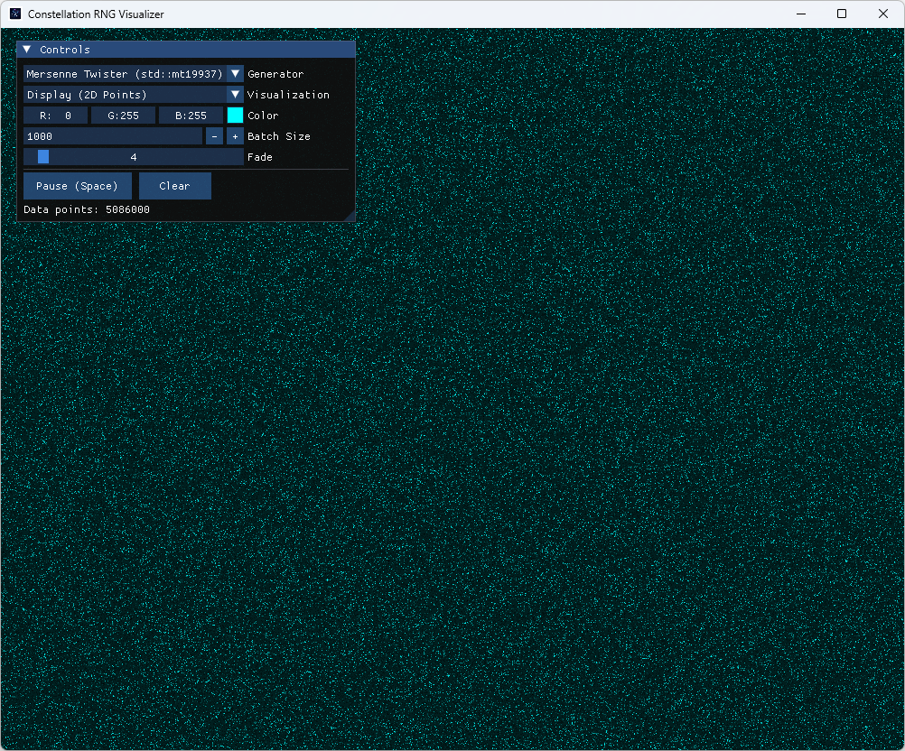
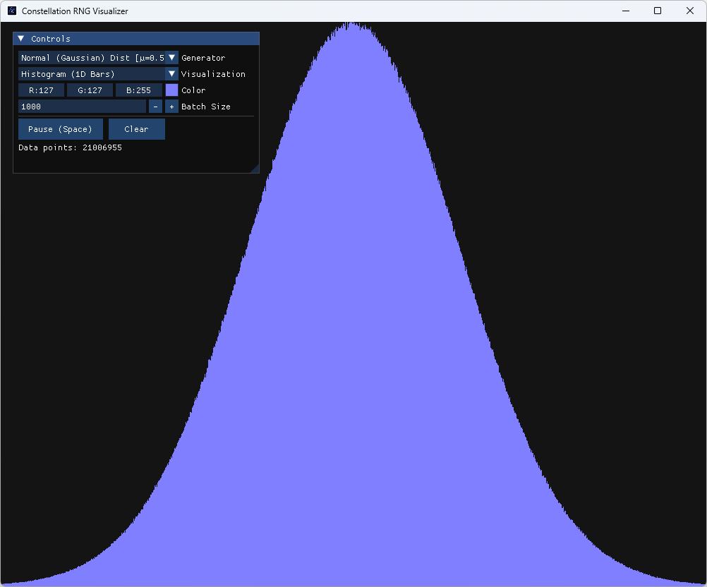

# Constellation RNG Visualizer

[](https://github.com/vikman90/constellation/actions/workflows/build.yml)

<p align="center">
  
  
</p>

Constellation is a C++ application designed to visually analyze the "quality" or "visual noise" of various Random Number Generators (RNG). It provides a graphical interface where users can quickly examine and compare the distribution and patterns produced by different algorithms in real-time.

By plotting thousands of random data points per frame, Constellation acts as a visual lens into the entropy and statistical distribution of numerical PRNG (Pseudo-Random Number Generator) engines.

## Features

- **Real-time generation and drawing:** See the distributions forming dynamically frame by frame.
- **Configurable Batching:** Control how many points are drafted each frame (e.g. 1 point/frame for slow formation, or 100,000 points/frame for instant clouds).
- **Multiple Engines:** Seamlessly switch between different random algorithms (both uniform and shaped distributions).
- **Color Customization:** Use a real-time color picker and a customizable fade trail intensity to customize the visuals.
- **Cross-Platform Building:** Powered by CMake, building automatically on Windows, Linux, and macOS.

## Integrated Generators

Constellation ships with several integrated RNG algorithms and distributions out of the box:

- **Mersenne Twister (`std::mt19937`):** The standard high-quality C++ uniform PRNG engine.
- **Standard C library (`rand()`):** The classic, simpler uniform generator.
- **Normal Distribution (Gaussian):** Uses `std::normal_distribution` (centered at µ=0.5, σ=0.15) to demonstrate probability clustering at the center. 
- **Exponential Distribution:** Uses `std::exponential_distribution` (λ=5.0) to demonstrate a steeply decaying probability curve.
- **Windows Cryptographic API:** Uses the OS-level `BCryptGenRandom` algorithm for secure randomness (Only available when compiled on Windows).

_Note: adding a new generator is as easy as implementing the `IGenerator` interface and registering it in the `GeneratorFactory`._

## Visualizations

The data output of the generators can be interpreted using different visualization strategies:

- **Display (2D Scatter Plot):**
  Uses the RNG to draw $(X, Y)$ coordinate points on a high-performance GPU-accelerated canvas. It features a customizable fade trail effect that dims old points over time. `(0,0)` is situated at the bottom-left corner and maps to the lowest possible output, while the opposite corner maps to the maximum value in both axes. A high-quality uniform generator will display uniform static noise over time, while biased generators might show stripes, clusters, or gradients.
  
- **Histogram (1D Bars):**
  A probability distribution bar chart that maps the numeric range to the exact window width (one bin per pixel column), making it resolution-independent. It incrementally counts generated values mapping them to density. The height of the graph is dynamically auto-scaled so the mathematical mean sits exactly at half the screen height, while clamping the absolute peak to prevent off-screen overflow.

## Dependencies

The project automatically handles downloading its dependencies during the CMake configure step via `FetchContent`:
- [SFML 2.x](https://www.sfml-dev.org/): For hardware-accelerated 2D graphics, window creation, and event handling.
- [Dear ImGui](https://github.com/ocornut/imgui): For the floating Graphical User Interface.
- [ImGui-SFML](https://github.com/SFML/imgui-sfml): The binding bridge between the two previous libraries.

## Compilation Instructions

This project uses modern CMake. It is completely cross-platform.

### Prerequisites
- A C++17 compatible compiler (MSVC, GCC, or Clang).
- CMake 3.16 or higher.
- A build system like Ninja, Make, or Visual Studio MSBuild.
- _On Linux_, you may need SFML system dependencies installed (e.g., `libfreetype6-dev`, `libx11-dev`, `libxrandr-dev`, `libudev-dev`, `libgl1-mesa-dev`, `libflac-dev`, `libogg-dev`, `libvorbis-dev`, `libopenal-dev`, `libxcursor-dev`).

### Build Steps (Terminal)

1. **Clone the repository:**
   ```bash
   git clone https://github.com/vikman90/Constellation.git
   cd Constellation
   ```

2. **Configure the project with CMake:**
   This will download SFML and ImGui automatically directly into the build directory.
   ```bash
   cmake -B build -G Ninja
   ```
   *(If you don't use Ninja, omit the `-G Ninja` flag to use your system's default generator, like Visual Studio on Windows or Makefiles on Linux/mac).*

   To also compile the unit tests (requires an internet connection to download Google Test), add `-DBUILD_TESTING=ON`:
   ```bash
   cmake -B build -G Ninja -DBUILD_TESTING=ON
   ```

3. **Build the application:**
   ```bash
   cmake --build build --config Release
   ```

4. **Run it:**
   ```bash
   # Windows (Visual Studio generator may append /Release to the path)
   .\build\Constellation.exe
   
   # Linux/macOS
   ./build/Constellation
   ```
   
   *(On Windows, the CMake script automatically copies the required SFML `.dll` files next to the generated executable after building).*

5. **Run the unit tests (optional):**
   ```bash
   cd build
   ctest -C Release --output-on-failure
   ```
   Tests cover generator output ranges and factory correctness, and are powered by [Google Test](https://github.com/google/googletest) (downloaded automatically by CMake).

## Architecture

The source code follows a clean, modular architecture:
- **`generators/`**: Implements the **Strategy pattern** with the `IGenerator` interface. A Factory instantiates the available list according to the current OS.
- **`visualizations/`**: Implements the **Strategy pattern** with the `IVisualization` interface, abstracting the SFML rendering logic.
- **`Application`**: Encapsulates the main OS and SFML loop.
- **`GuiPanel`**: Connects the core properties with Dear ImGui layout elements.
